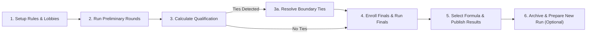

# Administrator Manual — Among Us: Live Deduction

This manual provides comprehensive instructions for tournament administrators orchestrating an **Among Us: Live Deduction** tournament.

---

## 1. Accessing the Admin Dashboard

1. Navigate to `/login` and authenticate with your administrator credentials.
2. Upon successful login, you will be directed to `/admin/dashboard`.
3. The dashboard is divided into key operational tabs:
   - **Overview & Live Stats**: High-level tournament metrics, registered participants, and active lobbies.
   - **Rounds & Lobbies**: Round creation, lobby scheduling, and status transitions.
   - **Scoring Rules**: Rule definitions, weights, and elimination boundaries.
   - **Volunteers**: Volunteer accounts and match assignments.
   - **Qualification**: Top-N calculation, tie detection, and tie-breaking.
   - **Finals & Results**: Final roster, formula selection, results publishing, and lock/unlock management.
   - **Audit Logs & Reset**: Append-only activity logs, CSV data exports, and tournament rerun preparation.

---

## 2. Tournament Lifecycle Management

---

## 3. Configuring Scoring Rules

1. Navigate to **Scoring Rules**.
2. Rules apply dynamically to all subsequent score entries.
3. Configurable parameters:
   - **Rule Name & Code**: e.g., `CREW_TASK_COMPLETE`, `IMPOSTOR_KILL`, `CORRECT_VOTE`.
   - **Points Weight**: Positive or negative integer values.
   - **Active Toggle**: Enable or disable rules without deleting them.
   - **Role Restriction**: Apply rules specifically to `CREW`, `IMPOSTOR`, or `ALL`.

---

## 4. Managing Rounds & Lobbies

1. **Creating a Round**:
   - Specify Round Name, Sequence Number, and Type:
     - `PRACTICE`: Excluded from preliminary leaderboard aggregations.
     - `PRELIMINARY`: Counted towards tournament qualification.
     - `FINAL`: Counted towards championship podium standings.
2. **Creating Lobbies**:
   - Each round consists of one or more lobbies (e.g., Lobby 1, Lobby 2).
   - Participants and volunteer scorekeepers are assigned to specific lobbies.

---

## 5. Qualification & Tie-Breaking

1. Navigate to **Qualification**.
2. Enter the cutoff threshold $K$ (e.g. top 10 players advance to the Finals).
3. Click **Calculate Qualification**.
4. **Boundary Tie Detection**:
   - If player at rank $K$ and player at rank $K+1$ share identical preliminary scores ($S_K == S_{K+1}$), a **Cutoff Tie** is flagged.
   - The platform strictly enforces fail-safe gating: automated arbitrary decisions are forbidden.
   - Click **Resolve Tie** and select an administrative resolution:
     - Specific qualified participants selected by admin decision.
     - Expand cutoff to include all tied participants.
5. Once resolved, the roster is approved for the Finals.

---

## 6. Finals Evaluation & Publishing Results

1. **Enroll Finalists**:
   - Navigate to **Finals & Results** and click **Enroll Finalists** to transfer qualified participants into the finals roster.
2. **Formula Selection**:
   - Select the championship calculation formula:
     - `SUM`: Overall Score = Preliminary Score + Final Score.
     - `WEIGHTED`: Overall Score = $(w_{\text{prelim}} \times \text{Prelim}) + (w_{\text{final}} \times \text{Final})$.
3. **Unresolved Final Ties**:
   - If participants tie for 1st place in the finals, the system retains:
     - `rank: null`
     - `winnerId: null`
   - The system **never invents an arbitrary winner or podium ordering**.
4. **Publishing Results**:
   - Click **Publish Results**. Once published, final standings and podium become visible to participants and the public at `/results`.

---

## 7. Results Lock & Unlock Workflow

- Publishing results automatically **locks** score editing across all final matches.
- If an administrative correction is required post-publication:
  1. Click **Unlock Results**.
  2. Enter a **Mandatory Reason** for unlocking (minimum 10 characters).
  3. The action and reason are permanently recorded in the immutable `audit_logs`.
  4. Perform necessary corrections and re-publish.

---

## 8. Tournament Reset & Option A Archival

When preparing for a new tournament run or exhibition match:
1. Navigate to **Tournament Settings** $\rightarrow$ **Prepare New Run**.
2. Click **Archive Current Run & Reset**.
3. **Option A Preservation Guarantee**:
   - All existing rounds, lobbies, and scores are marked with `isArchived: true`.
   - **Zero records are deleted or truncated**.
   - Historical scores and audit logs remain permanently accessible for compliance.
   - The active leaderboard resets cleanly for the new event run.

---

## 9. CSV Data Exports

Admins can download authoritative tournament data at any time from the dashboard:
1. **Participant List**: Registered participants, player IDs, and account statuses.
2. **Round Scores**: Granular score breakdowns across all rounds and lobbies.
3. **Final Leaderboard**: Aggregated preliminary and final scores with official ranks.
4. **Complete Score History**: Full audit trail of all score entries, updates, deltas, and editor IDs.
