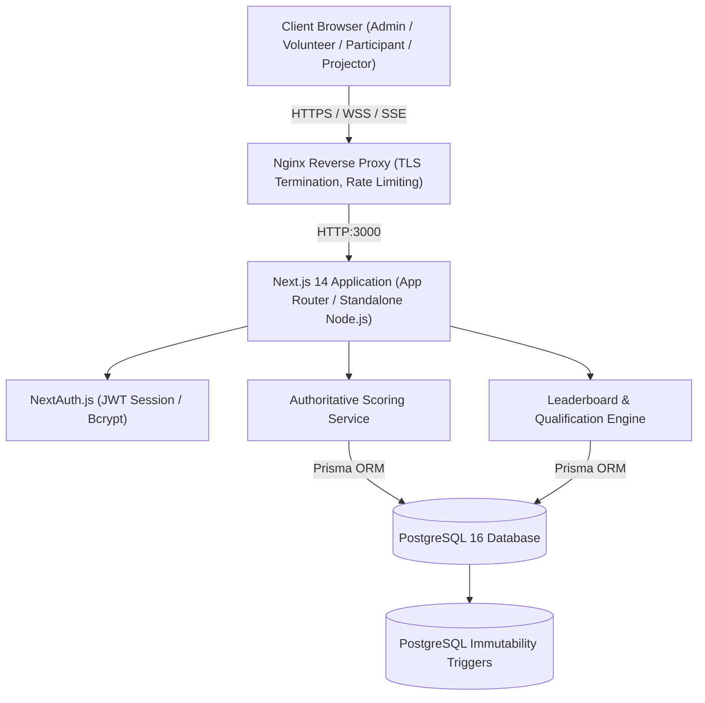
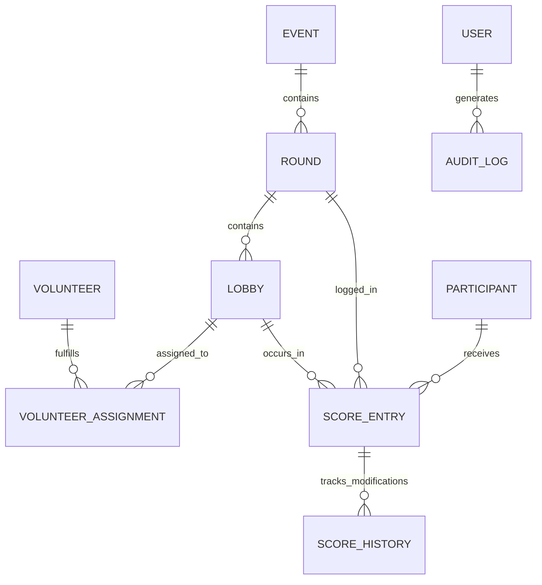
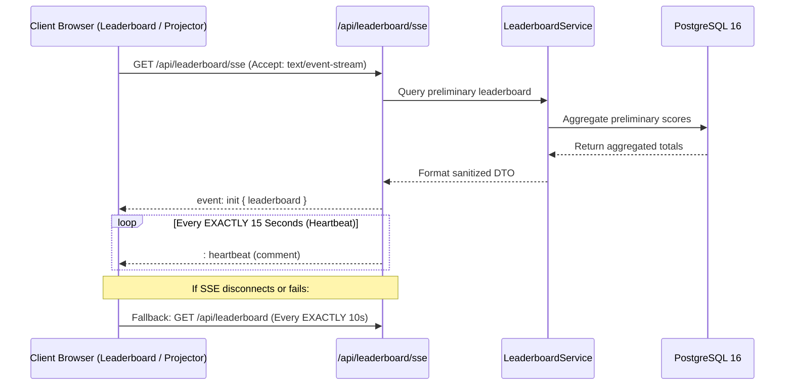

# System Architecture — Among Us: Live Deduction

This document details the high-level architecture, component topology, data persistence layer, real-time synchronization, and security model of the **Among Us: Live Deduction** platform.

---

## 1. System Topology & Component Overview

The application is structured as a unified Next.js 14 App Router application deploying server components, server actions, and route handlers on Node.js 20, backed by PostgreSQL 16.

---

## 2. Server & Client Boundaries

- **Server Components (RSC)**: Render static UI shells, layouts, and public tournament information without shipping JavaScript to the client.
- **Client Components**: Used strictly for interactive widgets:
  - Live Leaderboard with SSE stream listeners and automatic polling failover.
  - Volunteer Score Submission Forms with optimistic UI and validation.
  - Admin Modals (qualification tie-breaking, results unlock, round management).
- **Route Handlers (`src/app/api/**/route.ts`)**: Authoritative API layer providing REST and SSE endpoints with centralized error handling and authentication guards.

---

## 3. Database Architecture & Immutability Guarantees

The database schema is managed via Prisma ORM targeting PostgreSQL 16.

### Core Entity Relationships

### Immutability Triggers (Append-Only Protections)

To guarantee tournament integrity and prevent tampering, PostgreSQL triggers block `UPDATE` and `DELETE` statements on audit and historical score tables:

1. **`trg_audit_logs_no_update` & `trg_audit_logs_no_delete`**:
   - Attached to `audit_logs`. Any update or delete attempt raises an exception:
   - `RAISE EXCEPTION 'audit_logs records are strictly append-only and cannot be modified or deleted.'`
2. **`trg_score_history_no_update` & `trg_score_history_no_delete`**:
   - Attached to `score_history`. Ensures every score alteration creates an immutable historical ledger without deleting past entries.

---

## 4. Authoritative Backend Scoring Engine

Clients submit raw performance metrics (e.g. tasks completed, correct/incorrect votes, survivals, kills). Points are **never calculated on the client**:

1. Client sends raw stats to `POST /api/scores` or `PUT /api/scores/[id]`.
2. API validates session and volunteer assignment scope `(round_id, lobby_id)`.
3. `ScoringService` queries active `scoring_rules` from the database.
4. Rules are evaluated sequentially:
   - Base survival / task / kill points.
   - Vote accuracy multipliers.
   - Deduction penalties for false accusations or premature deaths.
5. Authoritative total score is calculated and persisted inside an atomic Prisma transaction.
6. A corresponding `score_history` snapshot is inserted recording the previous score, new score, delta, editor ID, and reason.
7. An `audit_logs` record is written.

---

## 5. Real-Time Leaderboard & SSE Streaming

- **SSE Heartbeat**: Transmitted every **EXACTLY 15 seconds** to prevent reverse proxy timeouts (e.g., Nginx `proxy_read_timeout`).
- **Polling Fallback**: If the SSE stream terminates or fails to establish, the client automatically falls back to polling `GET /api/leaderboard` every **EXACTLY 10 seconds**.
- **Scope Restriction**: The public leaderboard strictly aggregates **unarchived PRELIMINARY** rounds. PRACTICE matches and archived tournament runs are excluded.

---

## 6. Security Architecture

### Authentication & Sessions
- **NextAuth.js**: Credentials provider using JWT sessions (12-hour expiry).
- **Password Hashing**: `bcryptjs` with a work factor of 10 salt rounds.
- **Login Rate Limiter**: Maximum **5 failed attempts per 15 minutes** per composite key `${ip}:${normalizedIdentifier}`. Reset on successful authentication.

### Role-Based Access Control (RBAC)
- **ADMIN**: Full unrestricted access to tournament configuration, formulas, qualification, and audit logs.
- **VOLUNTEER**: Strictly restricted to scoring assigned `(round_id, lobby_id)` pairs. Forbidden from tournament administration.
- **PARTICIPANT**: Read-only access to personal stats, public schedule, and published results. Forbidden from viewing unassigned data or other participants' private records (IDOR protection).

### Production Error Sanitization
- Expected application errors (`ApiError`) return standard structured JSON with HTTP 400, 401, 403, 404, or 409 status codes.
- Unexpected 500 exceptions in production are masked as `"Internal server error"`, preventing stack trace or SQL leakage. Full details are logged to server-side stdout/stderr.
