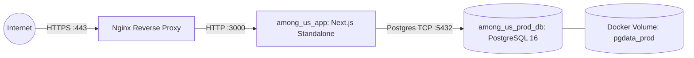

# Production Deployment Guide — Among Us: Live Deduction

This guide details the procedure for deploying the **Among Us: Live Deduction** platform to a production server environment using Docker, Docker Compose, PostgreSQL 16, and Nginx reverse proxy with TLS termination.

---

## 1. Infrastructure Requirements

- **Server Hardware**:
  - Minimum: 2 vCPU, 4 GB RAM, 20 GB SSD storage.
  - Recommended: 4 vCPU, 8 GB RAM, 50 GB SSD storage.
- **Operating System**: Ubuntu 22.04 LTS or Debian 12 recommended.
- **Software Dependencies**:
  - Docker Engine v24.0+
  - Docker Compose v2.20+
  - Nginx (for TLS termination and reverse proxy)
  - Certbot (for automated Let's Encrypt SSL/TLS certificates)

---

## 2. Production Docker Architecture

The production environment consists of two isolated containers managed by `docker-compose.prod.yml`:
1. `among_us_app`: Next.js 14 running in standalone mode on Node.js 20 Alpine as an unprivileged user (`nextjs:nodejs`).
2. `among_us_prod_db`: PostgreSQL 16 Alpine with persisted Docker volume `pgdata_prod`.



---

## 3. Step-by-Step Deployment Procedure

### Step 1: Clone Repository & Create Production Environment
```bash
git clone https://github.com/your-org/among-us-live-deduction.git /opt/among-us
cd /opt/among-us
```

Create a secure production environment file `.env.production`:
```bash
# Generate secure random passwords
POSTGRES_PASSWORD=$(openssl rand -base64 24)
NEXTAUTH_SECRET=$(openssl rand -base64 32)

cat <<EOF > .env.production
NODE_ENV=production
PORT=3000
POSTGRES_DB=among_us_deduction
POSTGRES_USER=tournament_admin
POSTGRES_PASSWORD=${POSTGRES_PASSWORD}
DATABASE_URL=postgresql://tournament_admin:${POSTGRES_PASSWORD}@db:5432/among_us_deduction?schema=public
NEXTAUTH_URL=https://tournament.yourdomain.com
NEXTAUTH_SECRET=${NEXTAUTH_SECRET}
EOF

chmod 600 .env.production
```

### Step 2: Build & Launch the Containers
```bash
docker compose --env-file .env.production -f docker-compose.prod.yml up -d --build
```

### Step 3: Run Database Migrations / Schema Push
```bash
docker compose --env-file .env.production -f docker-compose.prod.yml exec app npx prisma db push
```

### Step 4: Verify Container Health
Check container status and health endpoints:
```bash
docker compose -f docker-compose.prod.yml ps
curl -i http://localhost:3000/api/health
```
Expected response:
```http
HTTP/1.1 200 OK
Content-Type: application/json

{"status":"ok","timestamp":"2026-09-16T05:45:00.000Z"}
```

---

## 4. Nginx Reverse Proxy Configuration

Install Nginx and configure reverse proxy with TLS, HTTP/2, and SSE buffering disabled:

```nginx
# /etc/nginx/sites-available/tournament.yourdomain.com

server {
    listen 80;
    server_name tournament.yourdomain.com;
    return 301 https://$host$request_uri;
}

server {
    listen 443 ssl http2;
    server_name tournament.yourdomain.com;

    ssl_certificate /etc/letsencrypt/live/tournament.yourdomain.com/fullchain.pem;
    ssl_certificate_key /etc/letsencrypt/live/tournament.yourdomain.com/privkey.pem;
    ssl_protocols TLSv1.2 TLSv1.3;
    ssl_ciphers HIGH:!aNULL:!MD5;

    # Security Headers
    add_header X-XSS-Protection "1; mode=block" always;

    # Application Proxy
    location / {
        proxy_pass http://127.0.0.1:3000;
        proxy_http_version 1.1;
        proxy_set_header Upgrade $http_upgrade;
        proxy_set_header Connection 'upgrade';
        proxy_set_header Host $host;
        proxy_set_header X-Real-IP $remote_addr;
        proxy_set_header X-Forwarded-For $proxy_add_x_forwarded_for;
        proxy_set_header X-Forwarded-Proto https;
        proxy_cache_bypass $http_upgrade;
    }

    # SSE Streaming Endpoint (Disable Proxy Buffering)
    location /api/leaderboard/sse {
        proxy_pass http://127.0.0.1:3000;
        proxy_http_version 1.1;
        proxy_set_header Connection '';
        proxy_set_header Host $host;
        proxy_set_header X-Real-IP $remote_addr;
        proxy_set_header X-Forwarded-For $proxy_add_x_forwarded_for;
        proxy_set_header X-Forwarded-Proto https;
        
        proxy_buffering off;
        proxy_cache off;
        proxy_read_timeout 24h;
        chunked_transfer_encoding off;
    }
}
```

---

## 5. Database Backup & Disaster Recovery

### Automated Logical Backup (`pg_dump`)
Schedule a daily cron job to export compressed database snapshots:
```bash
# Create backup directory
mkdir -p /var/backups/among-us-db

# Dump command
docker compose -f /opt/among-us/docker-compose.prod.yml exec -T db \
  pg_dump -U tournament_admin -d among_us_deduction -F c -b -v > /var/backups/among-us-db/backup_$(date +%Y%m%d_%H%M%S).dump
```

### Restore Procedure (`pg_restore`)
To restore from a backup snapshot:
```bash
cat /var/backups/among-us-db/backup_20260916_050000.dump | \
  docker compose -f /opt/among-us/docker-compose.prod.yml exec -T db \
  pg_restore -U tournament_admin -d among_us_deduction --clean --if-exists
```

---

## 6. Zero Secrets Guarantee

The repository and container images adhere strictly to zero secret leakage:
- No passwords, private keys, or NextAuth secrets are stored in `Dockerfile` or `docker-compose.prod.yml`.
- All credentials are provided exclusively at runtime via `.env.production` or host environment variables.
- Production error responses mask internal exceptions to prevent credential or database leakage.
