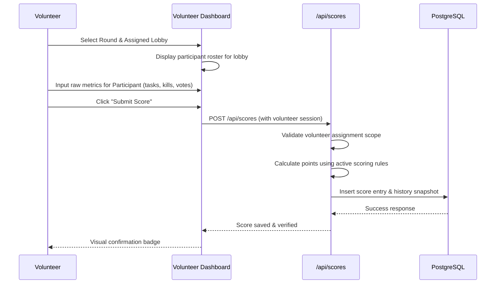

# Volunteer Manual — Among Us: Live Deduction

This manual guides volunteer scorekeepers through logging into the system, understanding their assignment scope, and authoritatively entering match performance scores.

---

## 1. Volunteer Role & Responsibilities

As a volunteer scorekeeper:
- You are responsible for observing gameplay in assigned lobbies and recording accurate player metrics.
- All scoring rules and calculations are automated; you only record raw match events (tasks completed, votes, deaths, kills).
- You can only enter and edit scores for the **exact round and lobby** assigned to you by the tournament administrator.

---

## 2. Logging In & Accessing Your Dashboard

1. Navigate to `/login` on your browser or mobile device.
2. Enter your volunteer credentials (e.g. username `volunteer1` and provided password).
3. Upon authentication, you will be redirected to `/volunteer/dashboard`.

---

## 3. Assignment Scope & Security

The platform enforces strict **Tuple Scope Isolation**:
- Your permissions are bound to specific `(round_id, lobby_id)` pairs.
- If you attempt to submit or view scores for an unassigned round or lobby, the backend will reject the request with `403 Forbidden`.
- If your assigned match is rescheduled or moved, contact an administrator to update your assignment.

---

## 4. Score Entry Workflow

### Step-by-Step Entry:
1. Select the active **Round** and your assigned **Lobby**.
2. Select the participant from the roster dropdown.
3. Fill in the match metrics:
   - **Role**: Crewmate or Impostor.
   - **Tasks Completed**: Count of verified tasks completed.
   - **Survival Status**: Survived round or eliminated (and elimination timing).
   - **Voting Performance**: Number of correct impostor votes cast vs incorrect crewmate accusations.
   - **Impostor Kills** (if applicable): Number of confirmed eliminations.
4. Click **Submit Score**.

---

## 5. Correcting / Updating Submitted Scores

If an observation error occurred or a match protest was upheld:
1. Open the existing score entry from your dashboard.
2. Update the incorrect metrics.
3. Enter a mandatory **Correction Reason** explaining the change.
4. Click **Update Score**.
5. The system authoritatively recalculates the score, logs the delta in `score_history`, and preserves the complete audit trail.

---

## 6. Troubleshooting & Best Practices

- **Touch Screen Optimization**: The volunteer dashboard is fully responsive with touch targets $\ge 44\text{px}$. Tablets and mobile phones are supported.
- **Connection Loss**: If internet connectivity drops during a match, keep your manual notes. The system validates score entries on the server; once reconnected, submit the scores.
- **Access Denied Error**: Ensure you have selected the correct Round and Lobby assigned to you. If the problem persists, verify with the tournament administrator.
